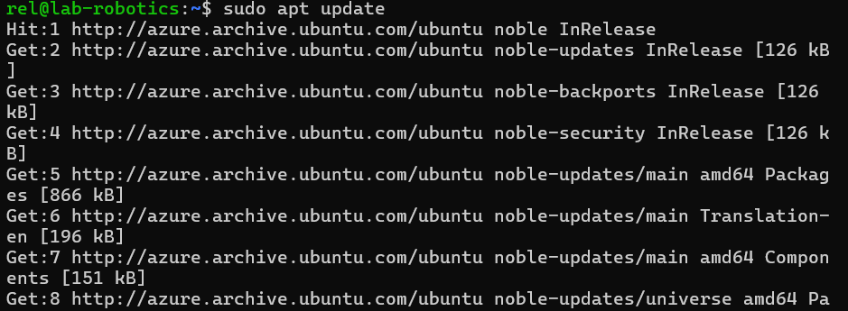

## APT assigment 

diwas kharel , amk1002644 , diwaskharel-afk
# Part 1: Understanding APT & System Updates

## Step 1: Check APT Version
    apt --version

 ## Step 2: Update the Package List

    sudo apt update

The sudo apt update command updates the package list from all configured repositories. It does not install any updates but checks for new versions of packages available in the repositories. Without running this command, the system would not be aware of the latest available updates.

## Step 3: Upgrade Installed Packages
    sudo apt upgrade -y

apt update only refreshes the list of available packages but does not install anything.

apt upgrade installs new versions of currently installed packages without removing or modifying existing dependencies.
## Step 4: View Pending Updates
    apt list --upgradable

No pending updates were found.

# Part 2: Installing & Managing Packages (20 min)

## 🔹 Step 5: Search for an Image Editor
    apt search image editor

## Step 6: Get Package Details
    apt show gimp

The "Depends" section lists the package dependencies. These dependencies are additional packages required for the software to function properly. If a dependency is missing, APT will automatically install it along with the main package.

##  Step 7: Install the Package
    sudo apt install gimp -y

## Step 8: Verify Installation
    apt list --installed | grep gimp

To confirm installation, the package should appear in the output. Additionally, you can try launching the software to ensure it works.

#  Part 3: Removing & Cleaning Packages (10 min)
## Step 9: Uninstall the Package
    sudo apt remove gimp -y

GIMP is removed, but configuration files remain.
## Step 10: Completely Remove GIMP
    sudo apt purge gimp -y
sudo apt remove gimp removes only the package files but keeps configuration files.

sudo apt purge gimp removes both the package files and configuration files, completely erasing the software from the system.

##  Step 11: Remove Unnecessary Dependencies
    sudo apt autoremove -y

The sudo apt autoremove command removes unused dependencies that were automatically installed but are no longer needed. This helps free up disk space and keeps the system clean.
##  Step 12: Clean Up Package Cache
    sudo apt clean
This command deletes downloaded package files from /var/cache/apt/archives/. It does not remove installed packages, but it frees up storage space by clearing unnecessary package archives.
#  Part 4: Managing Repositories & Troubleshooting (15 min)
## Step 13: View Software Repositories
    cat /etc/apt/sources.list

The file /etc/apt/sources.list contains the list of APT repositories used by the system. In newer Ubuntu versions, sources are now managed in /etc/apt/sources.list.d/ using .sources files in the deb822 format.

## Step 14: Add a New Repository
    sudo add-apt-repository universe
    sudo apt update

The universe repository contains community-maintained packages that are not officially supported by Ubuntu, but are still widely used.

## Step 15: Simulate an Installation Error
    sudo apt install fakepackage

This error means the package does not exist in any configured repository.
Check for typos in the package name.

Run apt search fakepackage to see if the package exists.
Ensure the correct repository is enabled (e.g., universe, multiverse).

Run sudo apt update to refresh package lists before installing.

#  Bonus Challenge: Holding & Unholding Packages
## Step 16: Prevent a Package from Updating
    sudo apt-mark hold gimp

## Step 17: Allow Updates Again
    sudo apt-mark unhold gimp

Holding a package prevents it from being updated when running apt upgrade. This is useful when:

A newer version has bugs that may break your system.

You need to keep an older version for compatibility.

You want to test a specific version without unexpected updates.
