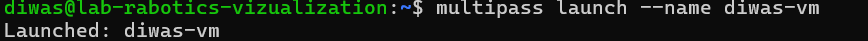

# Assignment 7: Linux Virtualization 
**Date:** 2025-02-20
**Author:** diwas kharel (amk1002644@student.hamk.fi) 

## Part 1: Virtualization Concepts

Virtualization

The process of creating a virtual version of something, such as hardware, storage, or network resources.

Hypervisor

Software that creates and manages virtual machines (VMs). Examples include KVM, VMware, and Hyper-V.

Virtual Machines (VMs)

Emulations of physical computers that run their own operating systems.

Containers

Lightweight, isolated environments that share the host OS kernel but have their own file systems and libraries.

### **VMs vs Containers**

- The difference between VMs and Containers in terms of Architecture, Resource Utilization and Isolation

| **Aspect**    | **VMs**                                          | **Containers**    |
|----------------------|------------------------------------------------|------------------------------|
| **Architecture**     | Requires a full OS for each instance            | Shares the host OS kernel      |
| **Resource Utilization** | Requires more resources                        | More lightweight and efficient   |
| **Isolation**        | Provides strong isolation since each VM has its own OS | Provides a lower level of isolation, as it shares the host OS kernel |

 

## Part 2: Multipass Implementation

### Installation
```bash
sudo snap install multipass
```

Screenshot of Multipass installation.


1. Launch a default Ubuntu instance

```bash
multipass launch --name diwas-vm
```


2. List all running instances

```bash 
multipass list
```


3. View details about an instance 

```bash
multipass info diwas-vm
```


4. Access the shell of a running instance

```bash
multipass shell diwas-vm
```


5. Stop, delete and purge an instance

```bash
multipass stop diwas-vm
multipass delete diwas-vm
multipass purge
```


### Learn About Cloud-Init Configuration

Create a cloud-init.yaml file to customize an instance.

```bash
nano cloud-init.yaml
```


Launch an instance with cloud-init

```bash
multipass launch --name diwas-vm --cloud-init cloud-init.yaml
```


3.  Create a new folder and Mount the folder inside a VM:

```bash
mkdir ~/multipass_shared
multipass mount ~/multipass_shared diwas-vm:/mnt/shared
```

I create a txt file inside multipass folder to share it in VM because without creating a file I can't mount the folder.

```bash 
echo "Hello, World!" > ~/multipass_shared/testfile.txt
```


Check the mounted folder inside the VM:

```bash
multipass shell diwas-vm
ls /mnt/shared
```
